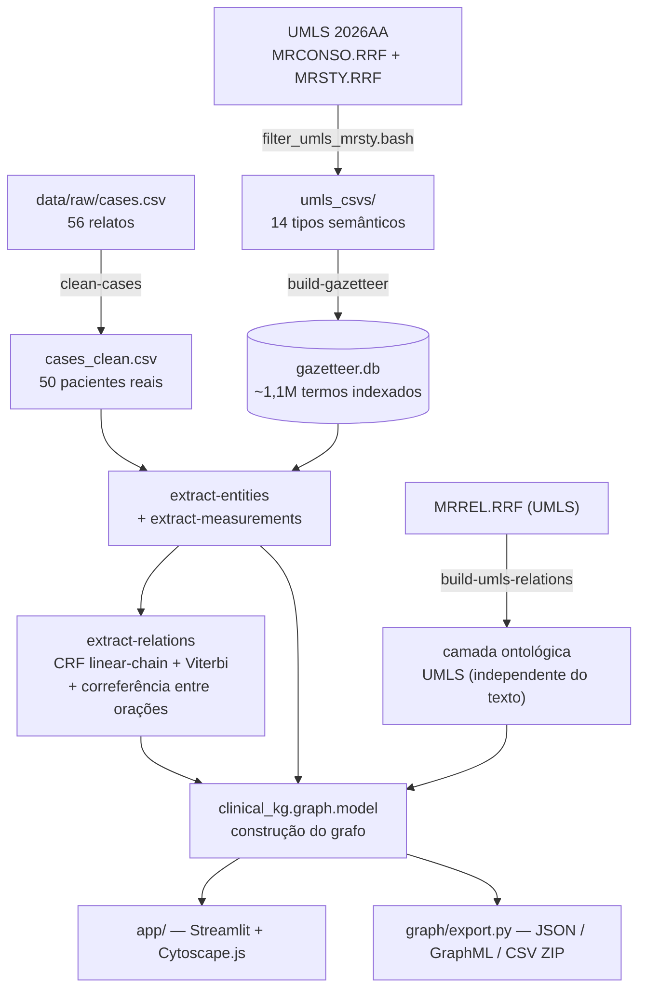

# Extração de Entidades Clínicas e Construção de um Grafo de Conhecimento a partir de Relatos de Caso
# Clinical Entity Extraction and Knowledge Graph Construction from Case Reports

## Slides

https://canva.link/6aev1x8heygc4ez 

## Metodologia

O pipeline parte de dois insumos independentes — o corpus de relatos de caso (MultiCaRe/PMC) e o
vocabulário controlado UMLS — que convergem na extração de entidades e, a partir daí, alimentam a
extração de relações:

**Estágio 1 — Limpeza do corpus (`clinical-kg clean-cases`).** O dataset de origem tem 56 linhas,
mas nem toda linha é um paciente: 2 artigos têm o relato de um único paciente fragmentado em várias
linhas (`PMC6083636` em 3 partes, `PMC11259348` em 2), e 3 linhas não são casos de um único paciente
(um resumo de coorte retrospectiva com 115 pacientes, um artigo de metodologia de ensino
odontológico e um artigo de sociologia sobre a Theranos — todos marcados incorretamente como
`case_amount=1` na fonte). Depois de fundir e descartar, restam **50 pacientes reais**. As colunas
`age`/`gender` originais também têm erros confirmados (um recém-nascido de 39 semanas de gestação
foi registrado como `age=39`), então são re-extraídas do próprio texto:

~~~python
# "newborn"/"neonate" é definitivo: idade 0, sobrepõe qualquer número de
# semanas/dias na mesma oração (idade gestacional, não tempo de vida).
if NEWBORN_RE.search(opening):
    return "0", "newborn-keyword"
~~~

Os valores originais são preservados em `age_upstream`/`gender_upstream` para auditoria.

**Estágio 2 — Vocabulário controlado (`filter_umls_mrsty.bash` + `build-gazetteer`).** A UMLS 2026AA
é filtrada para termos em inglês, não suprimidos, de 6 vocabulários-fonte (`SNOMEDCT_US`, `MSH`,
`LNC`, `RXNORM`, `ICD10CM`, `MTH`) restritos a 14 tipos semânticos (TUI). O resultado é indexado em
SQLite como um gazetteer de ~1,1 milhão de termos, com busca por "maior correspondência" eficiente
sem carregar tudo em memória.

**Estágio 3 — Extração de entidades (`clinical-kg extract-entities`).** Em cada posição do texto,
tenta-se a janela de 6 tokens até 1, pulando para depois do que der match:

~~~python
found, i = [], 0
while i < len(toks):
    hit = None
    for n in range(min(max_n, len(toks) - i), 0, -1):
        window = toks[i:i + n]
        norm = normalize(" ".join(t[0] for t in window))
        row = con.execute(LOOKUP, (norm,)).fetchone()
~~~

Cada tipo semântico (TUI) mapeia para uma das 6 categorias do projeto: **Diagnosis, Treatment,
Exam, Symptom, Finding, BodyPart**. Durante a auditoria dos resultados, percebemos que ~175
ocorrências eram palavras genéricas ou boilerplate de formulário de consentimento que casualmente
batiam com um conceito real de UMLS (ex.: a palavra solta "treatment", "diagnosis" ou "emergency",
que é literalmente um conceito MSH) — foram excluídas por CUI/termo (`EXCLUDED_CUIS`/
`EXCLUDED_TERMS`), deixando **2.957 entidades** (de uma extração bruta de 3.134).

**Estágio 4 — Medições e vínculo (`clinical-kg extract-measurements`).** Padrões de valor+unidade
(`4 cm`, `10-140 U/L`, `40 mg`, `day 8`) são vinculados à entidade mais próxima que os precede na
mesma oração — verificando também logo depois, para frases adjetivas ("8 cm spleen") — com uma
janela de caracteres como último recurso:

~~~python
def best_backward(candidates):
    chosen = None
    for ent in candidates:
        if ent["end"] > meas["start"]:
            continue
        if chosen is None or ent["end"] > chosen["end"]:
            chosen = ent
    return chosen
~~~

**Estágio 5 — Extração de relações (`clinical-kg extract-relations`, módulo
`clinical_kg/relations/`).** Até aqui o grafo só sabia dizer *"este caso menciona `chest pain` e
`hypertension`"* — nunca que um foi revelado por um exame ou tratado com um medicamento. Este
estágio resolve isso com um **CRF linear-chain** que faz BIO-tagging de gatilhos de relação sobre
cada oração e decodifica com **Viterbi**:

~~~python
"trans.B_I":               1.5,   # mantém gatilhos de múltiplos tokens ("was treated with")
"trans.B_B":              -3.0,   # proíbe dois gatilhos independentes adjacentes
"trans.max_trigger_len":   3,     # teto rígido
~~~

Não há dados rotulados para este corpus, então os pesos do CRF são **fixados à mão** (um único
dicionário `WEIGHTS`, auditável), mas o **limiar de decisão** (`decide.threshold`) já não é
adivinhado: foi medido contra o gold set (ver Resultados) e ajustado de 1.5 para **1.0**, o ponto
que melhora o recall sem perder precisão relevante. Cada aresta grava exatamente quais pesos
dispararam na coluna `rule_path`.

Duas peças foram adicionadas depois da primeira versão do CRF:

- **Correferência entre orações** (`relations/core/coreference.py`): um gatilho sem entidade à
  esquerda ("Diagnosed with pneumonia. Subsequently treated with ceftriaxone.") agora ainda se
  ancora ao paciente, herdando o contexto da oração anterior — sem isso essa relação era
  simplesmente inalcançável.
- **Camada ontológica de UMLS** (`relations/ontology.py`, `clinical-kg build-umls-relations`): além
  do texto, se dois conceitos que aparecem no mesmo paciente já têm uma relação documentada em
  UMLS (`MRREL.RRF` — `may_treat`/`may_be_treated_by` → `TREATED_WITH`,
  `has_finding_site`/`finding_site_of` → `LOCATED_IN`, `has_causative_agent`/`causative_agent_of`
  → `CAUSED_BY`), essa relação é adicionada como uma **evidência independente**, marcada
  `evidence_source=umls_ontology` e nunca confundida com a relação extraída do texto. A direção de
  cada `RELA` foi **verificada empiricamente** contra o `MRREL.RRF` real, não assumida pela
  gramática do nome — `may_treat`/`may_be_treated_by` não são espelho um do outro.

O gatilho decodificado se prende à **entidade mais próxima de cada lado dentro da mesma cláusula**.
Listas separadas por vírgula viram arestas `COORDINATE_WITH` que herdam a relação do primeiro item
da lista, desde que compartilhem o mesmo `entity_type` (ou um grupo compatível — `Symptom`/
`Finding`/`Diagnosis` — já que o gazetteer costuma tipar de forma inconsistente um item no meio de
uma lista limpa de sintomas). Por fim, um escopo de negação estilo NegEx/ConText rotula cada aresta
como `affirmed`, `negated`, `hedged`, `historical` ou `family`.

**A documentação completa de cada etapa** está em
[`src/clinical_kg/relations/README.md`](src/clinical_kg/relations/README.md).

## Trabalhos Estudados

O projeto adota uma abordagem de **NER léxico determinístico** (gazetteer + maior correspondência)
em vez de um extrator estatístico ou baseado em transformers. Essa escolha foi comparada, na
literatura de PLN clínico, com duas famílias de ferramentas consolidadas construídas sobre a mesma
UMLS:

- **MetaMap** (Aronson, 2001) — o mapeador de texto biomédico para a UMLS Metathesaurus de
  referência do NLM; usa análise linguística e variantes para encontrar conceitos, com maior
  cobertura porém menor previsibilidade do que um gazetteer fechado.
- **cTAKES** (Savova et al., 2010) — pipeline de PLN clínico da Mayo Clinic sobre Apache UIMA, com
  módulos de negação, seção e assertion status; a camada de relações tipadas (Estágio 5) cobre
  parte desse escopo com um CRF próprio em vez de UIMA.
- **scispaCy** (Neumann et al., 2019) — modelos estatísticos (spaCy) treinados para NER biomédico,
  com linking a UMLS via aproximação de caractere.

A escolha por um gazetteer de correspondência mais longa prioriza **determinismo e auditabilidade**:
cada entidade extraída é rastreável a uma regra e a um termo exato do gazetteer, sem dependências de
modelo, GPU ou dados de treinamento.

Para a extração de relações (Estágio 5), sem dados rotulados para este corpus, a equipe optou por
um **CRF linear-chain clássico** (Lafferty et al., 2001) em vez de um extrator de relações neural.
A modelagem de negação/asserção segue a linha **NegEx** (Chapman et al., 2001) e sua extensão
**ConText** (Harkema et al., 2009). A camada ontológica adicional (Estágio 5) segue a tradição de
**distant supervision**/conhecimento externo em extração de relações (Mintz et al., 2009), usando a
própria rede de relações da UMLS como segunda fonte de evidência, independente do texto.

## Modelo Lógico

Modelo de grafo de propriedades da equipe: cada caixa é um **tipo de nó** com suas propriedades,
cada seta é um **tipo de aresta** entre tipos de nó. `Concept` aparece duas vezes (origem/destino)
só para desenhar a aresta tipada entre dois conceitos — é o mesmo tipo de nó, parametrizado por
`entity_type` ∈ {Diagnosis, Treatment, Exam, Symptom, Finding, BodyPart}, não seis tipos separados.
As três camadas de relação clínica (estrutural, tipada extraída do texto via CRF, e ontológica via
UMLS) aparecem lado a lado, cada uma com sua própria cor/estilo de aresta:

- **Nós estruturais:** `Article`, `Person`, `Age`, `Sex`.
- **Nós de conceito clínico:** um por CUI agregado (`Concept`), tipado por propriedade
  (`entity_type` ∈ {Diagnosis, Treatment, Exam, Symptom, Finding, BodyPart}) em vez de um rótulo de
  nó por categoria.
- **Nó de medição:** `Measurement` (valor, unidade, faixa).
- **Identidade:** `person:{case_id}` · `concept:{cui}` · `measurement:{case_id}:{start}:{end}` ·
  `age:{case_id}` / `sex:{case_id}`.
- **Três camadas de relação clínica** coexistem no mesmo grafo, e não devem ser confundidas:

| Origem | Relação | Destino | Camada |
|---|---|---|---|
| Article | `REPORTS_PERSON` | Person | estrutural |
| Person | `HAS_AGE` / `HAS_SEX` | Age / Sex | estrutural |
| Person | `MENTIONS_DIAGNOSIS` \| `_TREATMENT` \| `_EXAM` \| `_SYMPTOM` \| `_FINDING` \| `_BODY_PART` | Concept | menção (sem tipo semântico) |
| Concept | `ASSOCIATED_WITH_MEASUREMENT` | Measurement | heurística |
| Person | `CONTAINS_UNLINKED_MEASUREMENT` | Measurement | heurística |
| Concept | `HAS_SYMPTOM` \| `HAS_DIAGNOSIS` \| `HAS_FINDING` \| `TREATED_WITH` \| `REVEALED_BY` \| `LOCATED_IN` \| `CAUSED_BY` \| `COORDINATE_WITH` | Concept | **relação tipada extraída do texto (CRF)** |
| Concept | `TREATED_WITH` \| `LOCATED_IN` \| `CAUSED_BY` (`evidence_source=umls_ontology`) | Concept | **relação ontológica (UMLS, independente do texto)** |

O `MENTIONS_*` original apenas afirma que um termo aparece no texto
(`assertion_status=not_assessed`). A camada de **relações tipadas do CRF** é o que distingue
*"tratado com"* de *"revelado por"* de *"localizado em"*, cada uma com seu próprio
`assertion_status`. A camada **ontológica de UMLS** é conhecimento médico geral, não uma afirmação
sobre o texto daquele paciente específico — por isso tem sua própria marca de proveniência e nunca
compartilha um id de aresta com uma relação extraída do texto.

## Análises que podem ser realizadas

- **Coocorrência diagnóstico–tratamento**: quais tratamentos aparecem mencionados junto a quais
  diagnósticos, agregando por CUI em vez de por ocorrência de texto.
- **Concentração de vocabulário**: quais CUIs/termos concentram mais menções no corpus, por
  categoria.
- **Cruzamento demográfico**: distribuição de categorias clínicas por faixa etária e sexo
  re-extraídos.
- **Distribuição de medições por entidade vinculada**: faixas de valores laboratoriais associados a
  um mesmo Exam ou Diagnosis entre pacientes.
- **Pacientes com achados compartilhados**: caminhos de dois saltos Person→Concept←Person para
  achar pacientes que compartilham um diagnóstico ou achado pouco comum.
- **Filtragem por confiança do vínculo**: repetir qualquer análise só com arestas `same_sentence`
  (alta confiança), descartando `window_fallback`.
- **Consultas dirigidas por relação tipada**: "quais achados foram `REVEALED_BY` qual exame", "qual
  `TREATED_WITH` está associado a qual `HAS_DIAGNOSIS`".
- **Filtragem por status de asserção**: repetir qualquer consulta só com relações `affirmed`,
  excluindo `negated`/`hedged`/`historical`/`family`.
- **Comparação texto vs. conhecimento geral**: para os tipos cobertos por ambas as camadas
  (`TREATED_WITH`, `LOCATED_IN`, `CAUSED_BY`), comparar o que o texto afirma sobre um paciente
  específico com o que UMLS documenta como relação geral entre os mesmos conceitos.

## Ferramentas

- **Python 3.11, stdlib apenas no pipeline** — todo o pacote `clinical_kg` roda sem dependências de
  terceiros, decisão deliberada para manter a extração reproduzível em qualquer máquina.
- **`pyproject.toml` + `Makefile`** — comando único `clinical-kg <etapa>`; `make test` / `make all`
  / `make app` cobrem o ciclo completo.
- **CRF linear-chain feito à mão** (`relations/core/crf.py` + `features.py`) — emissões, transições
  e Viterbi implementados diretamente, sem framework de ML.
- **SQLite** como gazetteer indexado — busca de maior correspondência sobre ~1,1M termos sem
  carregá-los em memória.
- **UMLS Metathesaurus 2026AA** como vocabulário controlado e, agora também, como **segunda fonte
  de relações** (`MRREL.RRF`) — não redistribuído por licença, cada usuário baixa e reconstrói
  localmente.
- **Streamlit + Cytoscape.js 3.33.1** (embutido localmente, MIT) para o visualizador interativo —
  única dependência externa do pipeline, junto com pandas.
- **Playwright** para o teste de fumaça de navegador.
- **Claude Code** como assistente de desenvolvimento (ver seção de LLMs abaixo).

## Resultados

| Métrica | Valor |
|---|---|
| Pacientes no corpus limpo | 50 (de 56 linhas originais) |
| Entidades extraídas | **2.957** (de uma extração bruta de 3.134 — ~175 falsos positivos genéricos removidos) |
| Medições extraídas | 535 |
| Medições vinculadas a uma entidade | 507 (95%) — 368 `same_sentence`, 54 `same_sentence_forward`, 85 `window_fallback` |
| Termos no gazetteer UMLS | ~1,1 milhão, cobrindo ~644 mil CUIs |
| **Relações tipadas extraídas (CRF)** | **1.356** sobre 50 pacientes, em 8 tipos |
| **Relações ontológicas (UMLS, camada independente)** | 213, em 3 tipos (`TREATED_WITH`/`LOCATED_IN`/`CAUSED_BY`) |

Distribuição das relações extraídas do texto:

| Relação | N | | Status de asserção | N |
|---|---|---|---|---|
| `TREATED_WITH` | 269 | | `affirmed` | 1.170 |
| `LOCATED_IN` | 239 | | `negated` | 95 |
| `REVEALED_BY` | 200 | | `hedged` | 48 |
| `HAS_DIAGNOSIS` | 189 | | `historical` | 32 |
| `COORDINATE_WITH` | 185 | | `family` | 11 |
| `HAS_FINDING` | 184 | | | |
| `HAS_SYMPTOM` | 55 | | | |
| `CAUSED_BY` | 35 | | | |

### Avaliação contra gold set

A equipe anotou manualmente **424 candidatos** (10 casos, dois anotadores — concordância de 9/10 na
sobreposição) usando `clinical-kg annotate-relations`. Contra esse gold set, no limiar de decisão
medido (`decide.threshold=1.0`):

**P=0.602 · R=0.653 · F1=0.626** (0.772 de acurácia no tipo da relação, 0.917 na asserção)

| Relação | F1 |
|---|---|
| `HAS_SYMPTOM` | 0.818 |
| `REVEALED_BY` | 0.744 |
| `LOCATED_IN` | 0.702 |
| `HAS_DIAGNOSIS` | 0.667 |
| `TREATED_WITH` | 0.632 |
| `COORDINATE_WITH` | 0.540 |
| `HAS_FINDING` | 0.462 |
| `CAUSED_BY` | 0.444 |

A tabela de ablação mostra que a **coordenação de listas** é de longe o componente que mais
contribui (removê-la derruba o F1 de 0.626 para 0.477, -0.150) — coerente com o achado de que 34%
dos pares de entidades adjacentes têm uma vírgula entre si. `HAS_FINDING` é o ponto mais fraco por
uma razão conhecida: é a categoria usada como *fallback* quando nenhuma mais específica encaixa, o
que gera falsos positivos sistemáticos; `CAUSED_BY` tem apenas 4 exemplos no gold set — pouco para
confiar no número em qualquer direção. O limiar de decisão em si foi escolhido por medição, não
suposição: no limiar anterior (1.5), o F1 era 0.501 (R=0.428); em 1.0, sobe para 0.626 (R=0.653)
sem perda relevante de precisão.

Todos os 71 testes automatizados do projeto passam sobre este mesmo checkout.

## Como Modelos de Linguagem foram Usados

**Na extração em si, não foram usados.** NER, vínculo de medições e extração de relações são todos
determinísticos (gazetteer + regras + um CRF de pesos fixados à mão, calibrado por medição contra
dados reais — não um modelo de linguagem nem uma rede neural treinada), uma escolha deliberada para
manter cada entidade e cada relação rastreável a uma regra auditável, sem risco de alucinação sobre
texto clínico — ver "Trabalhos Estudados" acima para a comparação com abordagens que usam PLN
estatístico ou neural.

Modelos de linguagem (Claude Code, Codex) foram usados como **assistentes de desenvolvimento** ao longo de
todo o projeto: implementação e refatoração de código (incluindo a correferência entre orações e a
camada ontológica de UMLS), depuração de bugs reais de dados (um problema de saltos de linha
`\r\n`/`\n` entre máquinas que invalidava offsets de anotação, e várias entidades falsas geradas por
palavras genéricas do gazetteer), reorganização do código-fonte, geração deste documento e do
diagrama do modelo lógico. Toda sugestão de código foi revisada e validada contra a suíte de testes
automatizados (71 testes) e contra o gold set anotado manualmente antes de ser incorporada.

## Referências Bibliográficas

- Aronson AR. Effective mapping of biomedical text to the UMLS Metathesaurus: the MetaMap program.
  *Proc AMIA Symp.* 2001:17-21.Link: https://pubmed.ncbi.nlm.nih.gov/11825149/ 
- Bodenreider O. The Unified Medical Language System (UMLS): integrating biomedical terminology.
  *Nucleic Acids Research.* 2004;32(Suppl 1):D267-D270. Link: https://doi.org/10.1093/nar/gkh061
- Savova GK, Masanz JJ, Ogren PV, Zheng J, Sohn S, Kipper-Schuler KC, Chute CG. Mayo clinical Text
  Analysis and Knowledge Extraction System (cTAKES): architecture, component evaluation and
  applications. *J Am Med Inform Assoc.* 2010;17(5):507-513.Link: https://doi.org/10.1136/jamia.2009.001560
- Neumann M, King D, Beltagy I, Ammar W. ScispaCy: Fast and Robust Models for Biomedical Natural
  Language Processing. *Proceedings of the 18th BioNLP Workshop and Shared Task.* 2019.
  https://arxiv.org/abs/1902.07669 
- Lafferty J, McCallum A, Pereira FCN. Conditional Random Fields: Probabilistic Models for
  Segmenting and Labeling Sequence Data. *Proceedings of the 18th International Conference on
  Machine Learning (ICML).* 2001:282-289. Link: https://www.cs.columbia.edu/~jebara/6772/papers/crf.pdf
  - Chapman WW, Bridewell W, Hanbury P, Cooper GF, Buchanan BG. A Simple Algorithm for Identifying
    Negated Findings and Diseases in Discharge Summaries. *Journal of Biomedical Informatics.*
    2001;34(5):301-310. Link: https://pubmed.ncbi.nlm.nih.gov/12123149/
- Documentação do projeto: [`src/README.md`](src/README.md) (instalação/execução),
  [`data/README.md`](data/README.md), [`src/clinical_kg/README.md`](src/clinical_kg/README.md),
  [`src/clinical_kg/relations/README.md`](src/clinical_kg/relations/README.md).
