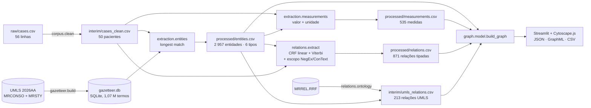
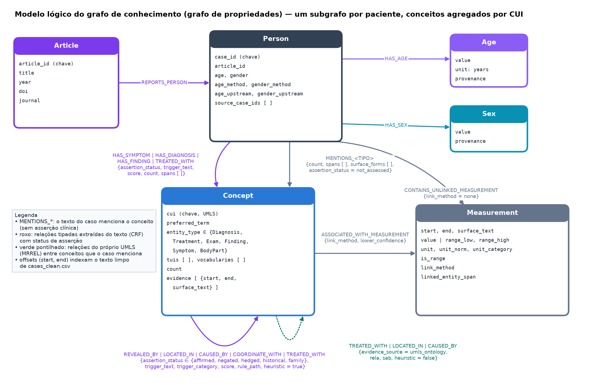
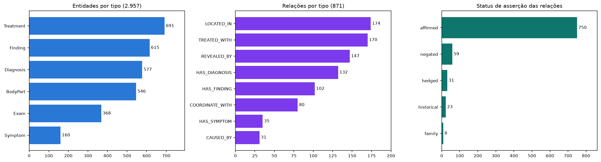
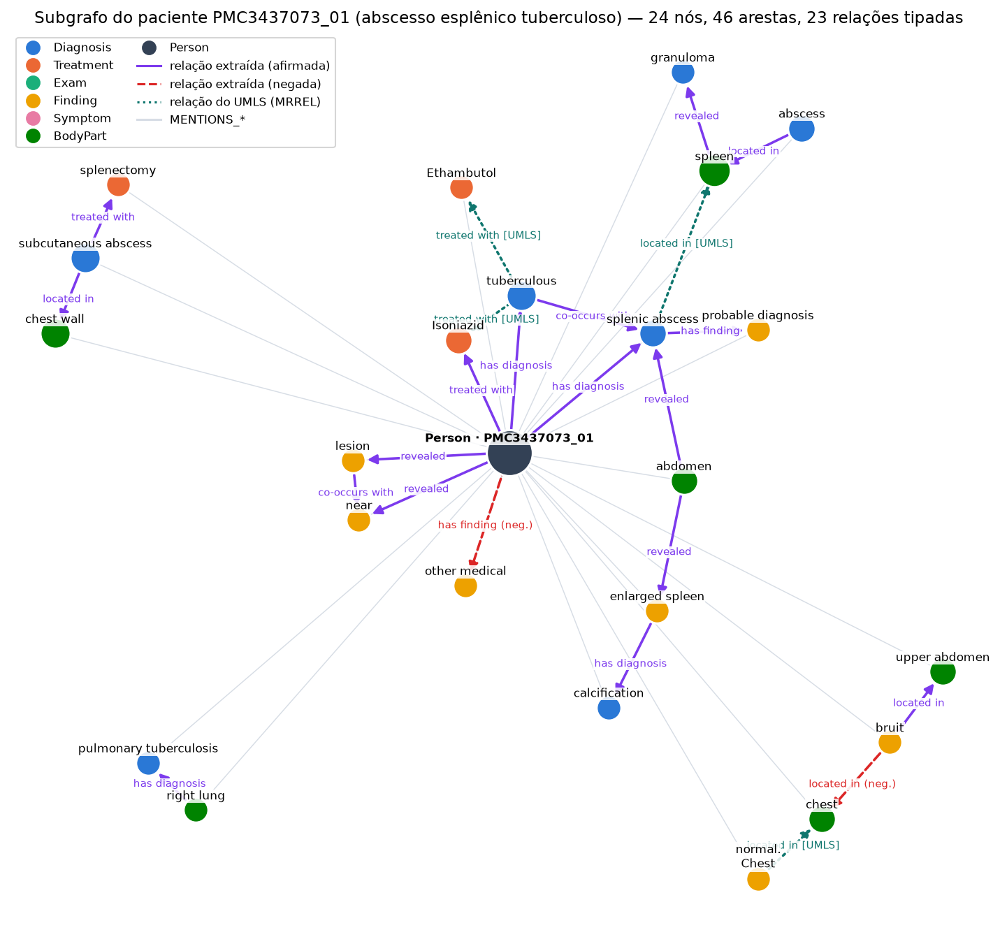

# Projeto `Grafo de Conhecimento de Relatos de Casos Clínicos`
# Project `Clinical Case Report Knowledge Graph`

*2026.2 Processamento de Línguas Naturais — Entrega 1*

## Slides

> Os slides da apresentação serão colocados em [`assets/slides/`](assets/slides/) (PDF) e o link
> atualizado aqui quando a apresentação estiver pronta.

## Metodologia

O projeto transforma 50 relatos de caso clínico de acesso aberto (PubMed Central, licença CC BY)
em um grafo de conhecimento **por paciente**, usando apenas métodos simbólicos e estatísticos
clássicos (sem modelos de linguagem na extração). O pipeline é implementado em Python padrão
(*stdlib*), roda de um checkout limpo (`make all`) e cada estágio produz um CSV cujos
**offsets de caracteres apontam para o texto limpo original**, de modo que toda aresta do grafo é
rastreável até o trecho que a justifica.



### Estágio 1 — Limpeza do corpus (`corpus/clean.py`)

O arquivo original tem 56 linhas para 50 pacientes reais: dois artigos tinham o relato de um único
paciente fragmentado em várias linhas (`PMC6083636`, `PMC11259348`) e três linhas não eram relatos
de caso (um estudo de coorte com 115 pacientes, um artigo de metodologia de ensino odontológico e um
artigo de sociologia). Os fragmentos são concatenados, as linhas espúrias descartadas, e **idade e
sexo são re-extraídos do próprio texto** com regras sobre a cláusula de apresentação
(`"A 44-year-old woman presented with…"`, recém-nascidos, números por extenso), porque as colunas
originais tinham erros confirmados (uma idade gestacional de 39 semanas registrada como `age=39`).
Os valores originais são mantidos ao lado (`age_upstream`, `gender_upstream`) para auditoria.

### Estágio 2 — Gazetteer UMLS e extração de entidades (`gazetteer/`, `extraction/entities.py`)

Do UMLS Metathesaurus filtramos termos em inglês de seis vocabulários (`SNOMEDCT_US`, `MSH`, `LNC`,
`RXNORM`, `ICD10CM`, `MTH`) restritos a 14 tipos semânticos (TUI), carregados num SQLite indexado.
A extração é **longest match**: em cada posição tenta-se a janela mais longa (6 tokens) até 1, e
salta-se o que casou — é isso que separa `acute pancreatitis` (C0001339) de `pancreatitis`
(C0030305). O TUI do conceito decide o tipo de entidade do projeto:

~~~python
TUI_TO_ENTITY = {
    "T184": "Symptom", "T033": "Finding",
    "T047": "Diagnosis", "T191": "Diagnosis", "T046": "Diagnosis", "T037": "Diagnosis",
    "T059": "Exam", "T060": "Exam", "T034": "Exam",
    "T061": "Treatment", "T121": "Treatment", "T200": "Treatment",
    "T023": "BodyPart", "T029": "BodyPart",
}
~~~

### Estágio 3 — Medidas (`extraction/measurements.py`)

Valores e intervalos com unidade (`850 U/L`, `10-140 U/L`, `4 cm`, `40mg`, `day 8`) são
reconhecidos sobre um vocabulário fechado de unidades clínicas e **ligados à entidade mais próxima
na mesma sentença** (com fallback por janela de caracteres). O método de ligação fica registrado
(`same_sentence`, `same_sentence_forward`, `window_fallback`, `none`) para que o grafo e o usuário
possam filtrar por confiança.

### Estágio 4 — Relações tipadas (`relations/`)

Não existe dado rotulado de relações para este corpus, e o projeto está restrito a métodos
simbólicos/estatísticos. A solução é um **CRF de cadeia linear com pesos definidos à mão**, que
etiqueta os *gatilhos* de relação (`showed`, `treated with`, `presented with`, `due to`…) em cada
sentença com tags `O / B-TRIG / I-TRIG / NEG` e decodifica por **Viterbi**. Os potenciais de
transição são o modelo de bigramas: `B→I` mantém gatilhos multi-token juntos, `B→B` proíbe dois
gatilhos adjacentes, `O→I` é impossível por validade BIO. Um POS *coarse* (léxico de 419 entradas +
sufixos) faz o *backoff* que permite generalizar — 87 % dos bigramas entre duas entidades ocorrem
uma única vez no corpus. Todos os pesos vivem num único dicionário auditável, e cada aresta grava
quais pesos dispararam (`rule_path`):

~~~python
WEIGHTS = {
    "trig.lexicon_hit":  3.0,   # token é um gatilho curado
    "trig.pos_verb":     1.2,   # verbo desconhecido: o backoff POS
    "trans.B_I":         1.5,   # mantém "was treated with" junto
    "trans.B_B":        -3.0,   # nunca dois gatilhos adjacentes
    "pair.same_clause":  1.2,   # a janela que substitui "mesmo parágrafo"
    "pair.coordinate":   2.0,   # irmão numa lista coordenada
    "decide.threshold":  1.5,
    # ...
}
~~~

Cada gatilho liga-se à entidade mais próxima de cada lado dentro da **cláusula**; sem entidade à
esquerda, ancora no nó `Person` quando o sujeito é o paciente (com correferência de sujeito elidido
entre sentenças). Listas coordenadas (`"fatigue, swollen abdomen, decreased appetite"`) herdam a
relação do primeiro membro em vez de serem descartadas — a vírgula separa 34 % dos pares adjacentes
do corpus. O tipo da relação vem da categoria do gatilho cruzada com os tipos dos argumentos, e a
aresta é reorientada se apontar contra a assinatura da relação.

Um **escopo de asserção** no estilo NegEx/ConText rotula cada relação como `affirmed`, `negated`,
`hedged`, `historical` ou `family`; o escopo abre num cue (`no`, `without`, `denied`, `possible`,
`history`, `mother`…) e fecha em fronteira de cláusula ou terminador (`but`, `however`):

> "Physical examination revealed abdominal pain in RIF, with localized tenderness in the RIF
> **but no** rebound tenderness was found." → `tenderness` afirmada, `rebound tenderness` negada.

Relações negadas são **rotuladas, nunca descartadas**: "sem rigidez de rebote" também é um fato
sobre o paciente.

### Estágio 5 — Segunda fonte de evidência: relações do próprio UMLS (`relations/ontology.py`)

Independente da redação do texto, o UMLS já afirma relações entre conceitos (`may_treat`,
`has_finding_site`, `has_causative_agent` em `MRREL.RRF`). O arquivo de ~6 GB é lido em *streaming*
direto do zip e filtrado aos pares de CUIs que as entidades do corpus realmente usam (213 relações).
Elas entram no grafo como uma **camada distinta** (`evidence_source = umls_ontology`), nunca
fundidas com as arestas extraídas do texto: "o UMLS relaciona estes conceitos em geral" não é
"este relato afirma isso para este paciente".

### Estágio 6 — Construção do grafo e visualização (`graph/`, `app/`)

`build_graph` monta um grafo por paciente, determinístico e validado (sem arestas pendentes, sem
IDs duplicados): conceitos agregados por CUI com todas as ocorrências como evidência, medidas
ligadas à ocorrência exata, relações tipadas com status de asserção e a camada UMLS. O visualizador
Streamlit roda a mesma extração ao vivo (≈35 ms por caso), destaca entidades no texto, desenha o
grafo em Cytoscape.js e exporta JSON, GraphML e CSV.

Toda a implementação está em [`src/clinical_kg/`](src/clinical_kg/); o notebook exploratório
inicial está em [`pipelines/notebooks/data_manipulation.ipynb`](pipelines/notebooks/data_manipulation.ipynb).
A documentação técnica completa de cada estágio segue no [Anexo](#anexo--documentação-técnica).

## Trabalhos Estudados

- **UMLS Metathesaurus** (Bodenreider, 2004) — a base de todo o reconhecimento de entidades: CUIs,
  tipos semânticos (MRSTY) e relações entre conceitos (MRREL). Adotamos a abordagem de *gazetteer*
  por casamento mais longo, na linha do **MetaMap** (Aronson & Lang, 2010), mas sem variantes
  léxicas geradas nem desambiguação por contexto; a agregação por CUI é o que permite o grafo
  colapsar `CT`, `computed tomography` e `CT scan` num único nó.
- **NegEx** (Chapman et al., 2001) e **ConText** (Harkema et al., 2009) — o algoritmo de escopo de
  negação por cues e terminadores, estendido a hipótese, história e experienciador (família). Nosso
  `assertion_states` é uma implementação direta dessa ideia sobre cláusulas em vez de sentenças.
- **Conditional Random Fields** (Lafferty, McCallum & Pereira, 2001) — o formalismo do etiquetador
  de gatilhos. Como não há dados rotulados, os potenciais são definidos à mão em vez de estimados;
  mantém-se a inferência por Viterbi e as restrições sequenciais (validade BIO, tamanho máximo de
  gatilho), que uma pontuação por par não consegue expressar.
- **i2b2/VA 2010 challenge** (Uzuner et al., 2011) — a referência para os tipos de relação clínica
  (problema–tratamento, problema–exame) e para o esquema de asserções (`present`, `absent`,
  `possible`, `hypothetical`, `conditional`, `associated with someone else`), do qual derivamos
  os cinco status usados aqui.
- **SemRep** (Rindflesch & Fiszman, 2003) — extração de predicações a partir de texto biomédico
  usando a Rede Semântica do UMLS; motivou a camada de relações ontológicas (`ontology.py`) como
  evidência complementar à extração textual.
- **Cookiecutter Data Science** — a estrutura de diretórios adotada (`data/raw|external|interim|processed`,
  `pipelines`, `src`, `assets`).

## Modelo Lógico

O grafo é um **grafo de propriedades** com um subgrafo por paciente. Nós: `Article`, `Person`,
`Age`, `Sex`, `Concept` (agregado por CUI, com `entity_type` em Diagnosis / Treatment / Exam /
Finding / Symptom / BodyPart), `Measurement`. Arestas: as de estrutura (`REPORTS_PERSON`,
`HAS_AGE`, `HAS_SEX`), as de menção (`MENTIONS_<TIPO>`), as de medida
(`ASSOCIATED_WITH_MEASUREMENT`, `CONTAINS_UNLINKED_MEASUREMENT`), as **oito relações tipadas
extraídas do texto** (`HAS_SYMPTOM`, `HAS_DIAGNOSIS`, `HAS_FINDING`, `TREATED_WITH`,
`REVEALED_BY`, `LOCATED_IN`, `CAUSED_BY`, `COORDINATE_WITH`, cada uma com `assertion_status`,
`trigger_text`, `score` e `rule_path`) e a camada ontológica do UMLS (`TREATED_WITH`,
`LOCATED_IN`, `CAUSED_BY` com `evidence_source = umls_ontology`).



| Origem | Relação | Destino | Semântica |
|---|---|---|---|
| Article | `REPORTS_PERSON` | Person | o artigo relata este paciente |
| Person | `HAS_AGE` / `HAS_SEX` | Age / Sex | demografia re-extraída do texto, com proveniência |
| Person | `MENTIONS_<TIPO>` | Concept | o relato menciona o conceito (sem asserção clínica) |
| Person / Concept | `HAS_SYMPTOM`, `HAS_DIAGNOSIS`, `HAS_FINDING`, `TREATED_WITH` | Concept | relação tipada extraída pelo CRF, com status de asserção |
| Concept | `REVEALED_BY`, `LOCATED_IN`, `CAUSED_BY`, `COORDINATE_WITH`, `TREATED_WITH` | Concept | idem, entre dois conceitos |
| Concept | `TREATED_WITH`, `LOCATED_IN`, `CAUSED_BY` (`umls_ontology`) | Concept | relação do UMLS entre conceitos que o caso menciona |
| Concept | `ASSOCIATED_WITH_MEASUREMENT` | Measurement | valor ligado à ocorrência exata, com `link_method` |
| Person | `CONTAINS_UNLINKED_MEASUREMENT` | Measurement | valor sem entidade resolvida |

Identidade: `person:{case_id}`, `concept:{cui}`, `measurement:{case_id}:{start}:{end}`; no modo de
ocorrências, `mention:{case_id}:{start}:{end}:{cui}`. Todo offset indexa o texto limpo com fim
exclusivo, e o construtor rejeita evidências cujo trecho não bate com o texto.

## Análises que podem ser realizadas

- **Perfil clínico por paciente com asserção**: quais sintomas/achados o texto *afirma*, *nega*,
  *hipotetiza* ou atribui à *família* — por exemplo, listar todos os achados negados
  (`assertion_status = negated`) para distinguir "sem derrame pericárdico" de um derrame presente,
  algo que um grafo de co-ocorrência simples não faz.
- **Tratamentos por diagnóstico ao longo do corpus**: agregar `Diagnosis –TREATED_WITH→ Treatment`
  entre os 50 pacientes para ver que fármacos e procedimentos aparecem associados a cada condição
  (e.g., `herpes zoster → acyclovir`, `SLE → prednisone, hydroxychloroquine`), e contrastar com a
  camada UMLS (`may_treat`) para separar o que o texto afirma do que a ontologia prevê.
- **Localização anatômica de achados**: consultas `X –LOCATED_IN→ BodyPart` respondem "que
  achados/diagnósticos foram localizados no baço, no pulmão direito…", cruzando com
  `REVEALED_BY` para saber qual exame os revelou.
- **Cadeias exame → achado → diagnóstico**: caminhos `Exam –REVEALED_BY→ Finding` e
  `Finding –HAS_DIAGNOSIS→ Diagnosis` reconstroem o raciocínio diagnóstico de cada relato.
- **Valores quantitativos por conceito**: `Concept –ASSOCIATED_WITH_MEASUREMENT→ Measurement`
  permite comparar distribuições (hemoglobina, lipase, dose de prednisona) entre pacientes e
  filtrar por confiança da ligação (`link_method`).
- **Estratificação demográfica**: como `Age` e `Sex` são nós com proveniência, é direto comparar
  padrões de diagnóstico ou tratamento por faixa etária/sexo, ou auditar onde a extração do texto
  discorda dos metadados originais.
- **Concordância texto × ontologia**: pares de conceitos com aresta tanto textual quanto
  `umls_ontology` são relações corroboradas; pares apenas na camada UMLS são hipóteses que o
  relato não afirma — um sinal útil de recall perdido pelo extrator.
- **Nível de artigo**: via `Article –REPORTS_PERSON→ Person`, análises por periódico, ano ou termos
  MeSH (`data/raw/metadata.csv`).

## Ferramentas

| Ferramenta | Uso | Discussão |
|---|---|---|
| **Python 3.11+ (biblioteca padrão)** | todo o pipeline de extração: `re`, `csv`, `sqlite3`, `zipfile`, `argparse`, `unittest` | Escolha deliberada: nenhuma dependência para rodar `make all`; o custo é implementar Viterbi, segmentação e escopo de negação à mão — o que também os torna auditáveis. |
| **UMLS 2026AA** (`MRCONSO`, `MRSTY`, `MRREL`) | dicionário de conceitos, tipos semânticos e relações ontológicas | Conteúdo licenciado, não redistribuível: cada membro baixa e gera localmente (`data/README.md`). `MRREL` (~6 GB) é lido em streaming do zip, nunca extraído. |
| **SQLite** | gazetteer indexado (1,07 M termos, 296 MB) | Consulta por termo normalizado e por chave ordenada (`"pancreatitis, acute"` ≡ `"acute pancreatitis"`); ~35 ms por caso. |
| **Streamlit** + **pandas** | visualizador interativo (texto anotado, grafo, tabelas, downloads) | Único componente com dependências externas; roda a mesma função de extração do CLI, logo app e pipeline nunca divergem. |
| **Cytoscape.js 3.33** (empacotado localmente) | renderização e interação com o grafo | Sem CDN nem build Node; estilos por tipo de aresta (relação afirmada, negada, camada UMLS) e inspetor de evidência com o trecho exato. |
| **GraphML / JSON / CSV ZIP** | exportação para Cytoscape desktop, Gephi ou análise em pandas | Atributos aninhados são serializados como JSON no GraphML. |
| **matplotlib / numpy** | figuras deste README | Só para documentação; não fazem parte do pipeline. |
| **unittest**, **Playwright** | 73 testes (segmentação, CRF, escopo, coordenação, grafo, app) e smoke test de navegador | Os testes de integração rodam quando o gazetteer local existe. |
| **Jupyter** | exploração inicial dos dados (`pipelines/notebooks/`) | O código de produção foi movido para `src/` para ser testável e executável por CLI. |

## Resultados

**Corpus e entidades.** 50 pacientes (28 mulheres, 22 homens; idade conhecida em 48), ~25 mil
palavras. A extração produz **2 957 entidades** ligadas a **1 353 CUIs** distintos — Treatment 691,
Finding 615, Diagnosis 577, BodyPart 546, Exam 368, Symptom 160 — 76 % delas via SNOMED CT. As
**535 medidas** ligam-se a uma entidade em 95 % dos casos (368 `same_sentence`,
54 `same_sentence_forward`, 85 `window_fallback`, 28 sem ligação).

**Relações.** O CRF extrai **871 relações tipadas** (17 por paciente): `LOCATED_IN` 174,
`TREATED_WITH` 170, `REVEALED_BY` 147, `HAS_DIAGNOSIS` 132, `HAS_FINDING` 102,
`COORDINATE_WITH` 80, `HAS_SYMPTOM` 35, `CAUSED_BY` 31; 307 ancoradas no paciente, 677 com gatilho
explícito. O escopo de asserção marca **59 negadas, 31 hipotéticas, 23 históricas e 8 familiares**
— 14 % das relações que um extrator sem NegEx afirmaria incorretamente. A camada UMLS acrescenta
213 relações ontológicas entre CUIs do corpus, das quais 89 caem dentro de um mesmo paciente.



**Grafo.** Somando os 50 subgrafos: **2 888 nós e 3 771 arestas**, todos com evidência textual
verificada na construção. O exemplo abaixo é o paciente `PMC3437073_01` (abscesso esplênico
tuberculoso): o exame de imagem do abdome `revealed` baço aumentado, o abscesso `located in` baço,
o tratamento com isoniazida/etambutol, uma relação **negada** (`no bruit`) e as arestas UMLS
(`Isoniazid may_treat tuberculous`, `abscess has_finding_site spleen`) coincidindo com o que o
texto afirma.



**Avaliação.** Sem dados de treino, o conjunto gold é *test-only*: 9 casos escolhidos
deterministicamente, espalhados por número de entidades, nunca usados para ajustar pesos. Foram
julgados **todos os 385 candidatos** que o gerador produz para esses casos (207 relações
verdadeiras, 178 rejeitadas), não só as arestas aceitas pelo modelo — senão o recall seria
imensurável. No limiar configurado (1,5):

| Métrica | Valor |
|---|---|
| Detecção — precisão / recall / F1 | **0,618 / 0,454 / 0,524** |
| Tipo de relação correto (sobre arestas detectadas) | 0,734 |
| Status de asserção correto (sobre arestas detectadas) | 0,883 |
| Melhor F1 na varredura de limiar | 0,675 (limiar 0,5: P 0,605 / R 0,763) |

Por relação, `HAS_SYMPTOM` (F1 0,95), `REVEALED_BY` (0,76) e `HAS_DIAGNOSIS` (0,74) funcionam
bem; `COORDINATE_WITH` (0,18) é o ponto fraco — a maioria das listas do corpus cruza tipos de
entidade ou tem tokens não-entidade entre os membros, e a regra de coordenação as rejeita. A
ablação mostra o que cada componente compra: remover a coordenação custa −0,079 F1, o *backoff*
POS −0,043, as transições do CRF −0,004; o escopo de asserção não altera a detecção mas responde
por +0,05 na acurácia de asserção. O limiar 1,5 troca ~30 pontos de recall por ~1 de precisão;
como o gold é test-only, a observação está registrada e não foi aplicada aos pesos.

**Limitações.** A extração de entidades é por dicionário: fragmentos (`"tuberculous"`,
`"pulmonary"`), abreviações ambíguas e termos genéricos geram nós espúrios que se propagam às
relações; a janela de candidatos (20 tokens, intra-sentença ou ancorada no paciente) limita o
recall estrutural; as medidas ligadas por `window_fallback` são de baixa confiança; e os pesos do
CRF, definidos à mão, não têm garantia de otimalidade — o `rule_path` de cada aresta e o
`--explain` do CLI existem justamente para que cada decisão seja inspecionável.

## Como Modelos de Linguagem foram Usados

- **Não na extração.** Por restrição do projeto, nenhum estágio do pipeline usa modelos de
  linguagem: reconhecimento de entidades por gazetteer UMLS, relações por CRF com pesos manuais,
  asserção por regras NegEx/ConText.
- **Assistentes de desenvolvimento.** Claude (Anthropic) e OpenAI Codex foram usados como
  assistentes de programação para implementação, refatoração, depuração e escrita de documentação
  (incluindo esta seção e as figuras deste README). Sugestões e alterações geradas foram revisadas
  e validadas pelos testes automatizados e de navegador antes de serem incorporadas.
- **Anotação do conjunto gold.** Os 385 candidatos de `data/interim/gold_relations.csv` foram
  julgados com auxílio do Claude, seguindo o esquema do projeto (tipos de relação, convenções de
  orientação e status de asserção) e lendo a sentença de cada candidato; os julgamentos estão
  registrados por par de offsets e podem ser revistos pela equipe com a ferramenta interativa
  `clinical-kg annotate-relations`. Os números da seção *Resultados* devem ser lidos com essa
  proveniência em mente.

## Referências Bibliográficas

- Bodenreider, O. (2004). The Unified Medical Language System (UMLS): integrating biomedical
  terminology. *Nucleic Acids Research*, 32(suppl_1), D267–D270.
  <https://doi.org/10.1093/nar/gkh061>
- Aronson, A. R., & Lang, F.-M. (2010). An overview of MetaMap: historical perspective and recent
  advances. *Journal of the American Medical Informatics Association*, 17(3), 229–236.
  <https://doi.org/10.1136/jamia.2009.002733>
- Chapman, W. W., Bridewell, W., Hanbury, P., Cooper, G. F., & Buchanan, B. G. (2001). A simple
  algorithm for identifying negated findings and diseases in discharge summaries. *Journal of
  Biomedical Informatics*, 34(5), 301–310. <https://doi.org/10.1006/jbin.2001.1029>
- Harkema, H., Dowling, J. N., Thornblade, T., & Chapman, W. W. (2009). ConText: An algorithm for
  determining negation, experiencer, and temporal status from clinical reports. *Journal of
  Biomedical Informatics*, 42(5), 839–851. <https://doi.org/10.1016/j.jbi.2009.05.002>
- Lafferty, J., McCallum, A., & Pereira, F. (2001). Conditional random fields: Probabilistic
  models for segmenting and labeling sequence data. *Proceedings of ICML 2001*, 282–289.
- Uzuner, Ö., South, B. R., Shen, S., & DuVall, S. L. (2011). 2010 i2b2/VA challenge on concepts,
  assertions, and relations in clinical text. *Journal of the American Medical Informatics
  Association*, 18(5), 552–556. <https://doi.org/10.1136/amiajnl-2011-000203>
- Rindflesch, T. C., & Fiszman, M. (2003). The interaction of domain knowledge and linguistic
  structure in natural language processing: interpreting hypernymic propositions in biomedical
  text. *Journal of Biomedical Informatics*, 36(6), 462–477.
  <https://doi.org/10.1016/j.jbi.2003.11.003>
- U.S. National Library of Medicine. UMLS Knowledge Sources, release 2026AA.
  <https://www.nlm.nih.gov/research/umls/index.html>
- Franz, M., Lopes, C. T., Huck, G., Dong, Y., Sumer, O., & Bader, G. D. (2016). Cytoscape.js: a
  graph theory library for visualisation and analysis. *Bioinformatics*, 32(2), 309–311.
  <https://doi.org/10.1093/bioinformatics/btv557>
- DrivenData. Cookiecutter Data Science.
  <https://drivendata.github.io/cookiecutter-data-science/>
- Template da disciplina: <https://github.com/santanche/nlp2learn/blob/main/projects/2026/template/project1/README.md>

---

# Anexo — Documentação técnica

> Referência detalhada de cada estágio (em inglês), mantida do README original do projeto. As
> instruções de instalação/execução também estão em [`src/README.md`](src/README.md); a
> arquitetura do pacote em [`src/clinical_kg/README.md`](src/clinical_kg/README.md); os dados e a
> obtenção do UMLS em [`data/README.md`](data/README.md).

### Quickstart

The pipeline is stdlib-only and runs from a plain checkout — the `Makefile`
puts `src` on `PYTHONPATH`, so nothing needs installing:

```bash
make test      # run the test suite
make all       # clean-cases -> entities -> measurements -> relations
make app       # launch the Streamlit viewer
make help      # list every target
```

Installing the package adds a `clinical-kg` command (equivalent to
`python3 -m clinical_kg`):

```bash
python3 -m venv .venv && . .venv/bin/activate
pip install -e .
clinical-kg                                    # list every command
clinical-kg extract-relations --explain PMC10106591_01
```

Only the Streamlit viewer needs third-party packages; every extraction stage is
standard library only.

### Project Structure

```
...
│
└── ProjetoNLP
    │
    ├── README.md  <- Project documentation
    │
    ├── data
    │   ├── external       <- Third-party data in input format for transformation
    │   ├── interim        <- Intermediate data, e.g., transformation results
    │   ├── processed      <- Final data used for publication
    │   └── raw            <- Original data without modifications
    │
    ├── pipelines
    │   └── notebooks      <- Jupyter notebooks or equivalent
    │       (no pipelines/workflows/: this project doesn't use Orange)
    │
    ├── pyproject.toml     <- Packaging, dependencies and the clinical-kg command
    ├── Makefile           <- Zero-install entry points (make test / all / app)
    │
    ├── src                <- Source code (src-layout: one installable package)
    │   ├── README.md       <- Basic install/run instructions
    │   └── clinical_kg
    │       ├── README.md      <- Architecture, layering and data flow
    │       ├── paths.py       <- Single source of truth for project paths
    │       ├── cli.py         <- One dispatcher over every pipeline stage
    │       ├── corpus/        <- Case cleaning and patient records
    │       ├── gazetteer/     <- UMLS term dictionary (SQLite)
    │       ├── extraction/    <- Entities and measurements
    │       ├── relations/     <- Typed clinical relations (CRF)
    │       ├── graph/         <- Graph model, export and viewer
    │       └── app/           <- Streamlit front end
    │
    ├── tests              <- Test suite (python3 -m unittest discover -s tests)
    │
    └── assets             <- Media used in the project
        ├── images         <- Images used in README.md text
        └── slides         <- PDF slides
```

### External Data (UMLS 2026AA)

The project uses **UMLS semantic classification** for medical entity extraction. Data is located in `data/external/umls_csvs/` organized by **14 semantic types (TUI)**:

| CSV File | TUI | Semantic Type | Concept | Examples |
|---------|-----|----------------|---------|----------|
| `umls_T047_Disease_or_Syndrome.csv` | T047 | Disease or Syndrome | Clinical conditions | acute pancreatitis, diabetes |
| `umls_T200_Clinical_Drug.csv` | T200 | Clinical Drug | Medications | aspirin, metformin, ibuprofen |
| `umls_T023_Body_Part_Organ.csv` | T023 | Body Part or Organ | Anatomy | pancreas, stomach, liver |
| `umls_T191_Neoplastic_Process.csv` | T191 | Neoplastic Process | Cancers/Tumors | gastric neoplasia, leukemia |
| `umls_T033_Finding.csv` | T033 | Finding | Clinical findings | elevated glucose, fever |
| `umls_T037_Injury_or_Poisoning.csv` | T037 | Injury or Poisoning | Trauma | fracture, burn, intoxication |
| `umls_T046_Pathologic_Function.csv` | T046 | Pathologic Function | Dysfunctions | hemorrhage, hypertension |
| `umls_T059_Laboratory_Procedure.csv` | T059 | Laboratory Procedure | Lab tests/analyses | blood test, urinalysis |
| `umls_T060_Diagnostic_Procedure.csv` | T060 | Diagnostic Procedure | Diagnostic procedures | computed tomography, endoscopy |
| `umls_T061_Therapeutic_Procedure.csv` | T061 | Therapeutic Procedure | Surgical treatments | surgery, transplant |
| `umls_T121_Pharmacologic_Substance.csv` | T121 | Pharmacologic Substance | Chemical components | penicillin, morphine |
| `umls_T029_Body_Location_or_Region.csv` | T029 | Body Location or Region | Regional anatomy | abdomen, thorax |
| `umls_T184_Sign_or_Symptom.csv` | T184 | Sign or Symptom | Clinical manifestations | cough, headache |
| `umls_T034_Laboratory_or_Test_Result.csv` | T034 | Laboratory or Test Result | Test values | glucose level, blood pressure |

**Consolidated file:** `umls_clinico_todos.csv` (~190 MB, 1,666,483 rows covering 644,516 unique CUIs across all 14 types)

> Note: the CSVs quote fields that contain commas (e.g. `"muscle, abdominal"`),
> so they must be parsed with a real CSV reader — `cut -d,` / `awk -F,` will misparse them.

### Gazetteer

`src/clinical_kg/gazetteer/build.py` loads these CSVs into an indexed SQLite database used for
longest-match entity extraction:

```bash
bash data/external/filter_umls_mrsty.bash   # produces data/external/umls_csvs/
clinical-kg build-gazetteer              # produces data/interim/gazetteer.db
```

### Data Cleaning

`data/raw/cases.csv` comes from an upstream dataset build we don't control and has no source
code of its own -- just a one-line field description in `data/raw/data_dictionary.csv`. It has
confirmed issues: rows that are chapters of one patient's report split across several `case_id`s,
rows that aren't single-patient case reports at all, and an `age`/`gender` pair that's occasionally
wrong (e.g. a newborn's *39-week gestational age* recorded as `age=39`).

`src/clinical_kg/corpus/clean.py` addresses this before anything else runs:

```bash
clinical-kg clean-cases                  # data/raw/cases.csv -> data/interim/cases_clean.csv
```

- **Merges** 2 articles whose case report was split across multiple `case_id` rows into one row
  per real patient (`PMC6083636`: 3 fragments -> 1; `PMC11259348`: 2 -> 1).
- **Drops** 3 rows that aren't single-patient cases: a 115-patient retrospective cohort summary,
  a dental-education methodology paper, and an unrelated sociology paper about Theranos -- all
  three slipped in under `case_amount=1` upstream.
- **Re-derives `age`/`gender` from the case text itself** (regex against the patient-introducing
  clause -- `"A/An <N>-year-old..."`, newborn/infant language, spelled-out numbers, explicit
  gender words, pronoun-majority fallback) instead of trusting the upstream columns. Both the
  upstream and self-extracted values are kept side by side (`age`/`gender` vs.
  `age_upstream`/`gender_upstream`) for auditing.

Corpus goes from **56 rows to 50 real patients**. Every downstream script takes `--cases`, so
they all point at the cleaned file instead of the raw one from here on.

### Entity Extraction

`src/clinical_kg/extraction/entities.py` runs longest-match extraction over the cleaned corpus:

```bash
clinical-kg extract-entities --cases data/interim/cases_clean.csv \
                                 --out data/processed/entities.csv
```

Yields **3,134 entities across 50 patients**, typed as Treatment / Finding / Diagnosis / BodyPart /
Exam / Symptom. Each row carries character offsets, CUI, TUI and source vocabulary. See
`TUI_TO_ENTITY` in [`src/clinical_kg/extraction/entities.py`](src/clinical_kg/extraction/entities.py)
for the TUI-to-entity mapping.

### Measurements

Medications are not extracted as a separate category: RXNORM/MSH already resolve most drug names
inside the gazetteer's `Treatment` type (alongside `T061` therapeutic procedures), and the team
decided a suffix-pattern fallback for the rest wasn't worth the added complexity for this stage.

`src/clinical_kg/extraction/measurements.py` finds value(+range)+unit spans (`850 U/L`, `10-140 U/L`, `4 cm`,
`40mg`, `day 8`) over a closed clinical unit vocabulary, then links each one to the nearest gazetteer
entity that precedes it in the same sentence -- checking just after the value too, for the common
adjectival phrasing ("4 cm pseudocyst", "5-day history") -- falling back to a character window when
the sentence has no candidate:

```bash
clinical-kg extract-measurements --cases data/interim/cases_clean.csv \
                                     --out data/processed/measurements.csv
```

Against the full gazetteer: **535 measurements across 50 patients**, and 516 of them (96%) resolve
to a linked entity -- 382 `same_sentence` (high-confidence), 55 `same_sentence_forward` (adjectival,
e.g. "8 cm spleen"), 79 `window_fallback` (lower-confidence), 19 `none`.

Stdlib-only, following the same offset/normalization conventions as `extract_entities.py` so its
output lines up with `entities.csv` by character position. Known limitation: the nearest-entity
heuristic has no notion of hospital-outcome spans ("discharged on day 8"), so a duration mentioned
late in a case can link to the wrong entity instead -- downstream users can filter on `link_method`
(`same_sentence` is high-confidence, `window_fallback` is not) or discard unlinked rows.

#### About `data/external/filter_umls_mrsty.bash`

This file was missing from the repository (not in git history, and this clone has no configured
remote to re-fetch it from), so it was reconstructed from this README's own spec -- English,
non-suppressed, the same six vocabularies and 14 semantic types, same column names. Real run against
the two UMLS zips: **1,617,808 consolidated rows** and a **1,073,291-term / 296 MB gazetteer**,
close to but not identical to the numbers quoted elsewhere in this document (1,666,483 / 1,097,541 /
289 MB) -- expected, since this is a reconstruction, not the original byte-for-byte script. If the
original teammate's version turns up, prefer it and diff the two rather than assuming they match;
whichever one is kept should be the one actually committed to git going forward.

### Relations

`src/extract_relations.py` extracts typed, directed clinical relations between the entities,
using a **linear-chain CRF** that BIO-tags relation triggers over each sentence and decodes with
Viterbi:

```bash
clinical-kg extract-relations --cases data/interim/cases_clean.csv \
                                 --entities data/processed/entities.csv \
                                 --out data/processed/relations.csv
```

Yields **871 relations across 50 patients** in eight types -- `TREATED_WITH`, `LOCATED_IN`,
`HAS_DIAGNOSIS`, `REVEALED_BY`, `HAS_FINDING`, `COORDINATE_WITH`, `HAS_SYMPTOM`, `CAUSED_BY` --
each carrying an **assertion status** (`affirmed` / `negated` / `hedged` / `historical` /
`family`), so "examination revealed tenderness ... but **no** rebound tenderness" does not become
an affirmed symptom.

The CRF's weights are **set by hand** (`src/clinical_kg/relations/core/features.py`, one auditable `WEIGHTS` dict),
not learned: this project has no labeled relation data. A linear-chain CRF is a log-linear model
over sequences, so hand-set potentials keep Viterbi inference and the sequence constraints that a
per-pair score cannot express -- BIO validity, one trigger per clause, a trigger-length cap -- while
giving up any claim the weights are optimal. Every edge therefore records which weights fired in a
`rule_path` column, and `--explain CASE_ID` prints scored relations for one case.

The implementation is isolated in `src/clinical_kg/relations/` (segmentation, coarse POS, the weight table,
the CRF, extraction, annotation and evaluation), stdlib-only like the rest of the pipeline;
`src/extract_relations.py` is a compatibility entry point, following the `graph_export.py`
convention.

**[`src/clinical_kg/relations/README.md`](src/clinical_kg/relations/README.md) documents the full process** -- each stage,
what the corpus measurements showed, and why each design choice was made. Two highlights: POS
exists because 87% of the bigrams between two entities occur exactly once (`presented by` appears
once in the corpus, `reported with` never), and the "discard any pair with a comma between them"
rule had to be **inverted**, since a comma sits between 34% of adjacent entity pairs and
coordinated lists are the most productive relation pattern in the text.

#### Evaluating relations

With no labels to train on, the gold set is **test-only**: 9 cases chosen deterministically and
spread by entity count, never used to tune the weights.

```bash
clinical-kg annotate-relations     # build the gold set (resumable, accept/reject)
clinical-kg evaluate-relations     # P/R/F1, threshold sweep, per-relation, ablation
```

The annotator enumerates every *candidate* pair rather than the edges the model accepted -- judging
only the model's own output would measure precision and leave recall unmeasurable. Because the
weights are hand-set, the defensible claim is a component one, so the evaluator prints an ablation
table showing what the POS backoff, coordination inheritance, assertion scoping and CRF transitions
each contribute. Recall ceilings (the candidate window, and how many candidates were judged) are
printed alongside.

The gold set is annotated: 385 candidates over the 9 cases, 207 true relations. At the configured
threshold the extractor scores **P 0.62 / R 0.45 / F1 0.52** on detection, with 73% of detected
edges correctly typed and 88% carrying the right assertion status; the sweep peaks at F1 0.68 at
threshold 0.5. Details and the ablation table are in
[`src/clinical_kg/relations/README.md`](src/clinical_kg/relations/README.md#results).

### Visualization

`src/clinical_kg/app/main.py` is a Streamlit viewer that highlights entities inline, for either a corpus case or new
text you paste or upload. Extraction runs live (~35 ms per case) through the same `extract()`
function the CLI uses, so the app and the pipeline can never disagree. The corpus source is
`data/interim/cases_clean.csv` (50 patients, see Data Cleaning above), not the raw file -- the
sidebar shows each selected patient's `case_id`, self-extracted age and sex alongside the text.

The **Knowledge Graph** tab uses that same cleaned patient and live extraction.
It represents Person, Age, Sex, the six clinical entity categories and their
linked measurements. Select nodes or edges to inspect source text and methods;
switch between concepts aggregated by CUI and individual occurrences; filter
types and association methods; and export JSON, GraphML or CSV ZIP. Relation
labels and an explicit Relations table make the graph's meaning inspectable.

Measurements are hidden initially: click a concept to reveal its associated
values, or Person to reveal unlinked measurements. Clicking the background hides
them again. The Measurements control also offers Hide all; there is no automatic
Show all mode. Changing cases or filters clears previous expansions.
The canvas provides search by name/CUI, focus selection, zoom buttons and Escape
to clear selection. Circular nodes and zoom-sensitive labels reduce clutter.
Enable **Group by IS_A category** to arrange concepts around Treatment, Diagnosis,
Exam, Finding, Symptom and BodyPart class nodes. Multi-type concepts keep every
IS_A relation (their visual placement uses one class). These are project semantic
categories, not inferred clinical assertions or the full UMLS hierarchy.

Extracted relations are passed to `build_graph(..., relations=...)` and become typed directed
edges alongside the `MENTIONS_*` scaffolding, each retaining its assertion status, trigger text and
score -- extracted live in the viewer and the default export (same `analyze_case` as the CLI), or
read from `data/processed/relations.csv` with `export-graph --from-csv`. When
`data/interim/umls_relations.csv` exists (`clinical-kg build-umls-relations`), UMLS's own relations
between the case's concepts are drawn as a separate dotted layer, never merged with text-derived
edges. Both layers can be toggled in the graph filters. A relation whose endpoints do not resolve
to an entity occurrence is reported in `warnings` rather than attached to an arbitrary node, and a
negated relation is labelled, never silently dropped.

`Person` is identified by the cleaned `case_id` (including merged `_P1` IDs).
`HAS_AGE` and `HAS_SEX` use the cleaning output and retain extraction methods,
upstream values and `source_case_ids` for auditing. Missing age produces no Age
node; newborn age **0** is retained. Clinical links are typed `MENTIONS_*`
relations, and measurement links remain `ASSOCIATED_WITH_MEASUREMENT` with their
original occurrence offsets and `link_method`. A text mention does not establish
a confirmed diagnosis, treatment administration or causality.

All downstream defaults now use `data/interim/cases_clean.csv` via
`src/clinical_kg/paths.py`. The app and graph export CLI extract directly from the
selected cleaned text, so stale processed CSVs cannot introduce dropped patients
or lose the merged fragments. Optional `--from-csv` export validates corpus IDs
and offsets and rejects incompatible annotations; `--cases` still supports an
explicit alternative corpus. See [source documentation](src/clinical_kg/README.md) for the
graph schema, CLI, provenance and tests.

```bash
make app                                  # no install needed
```

or, to get the `clinical-kg` command on your PATH:

```bash
python3 -m venv .venv && . .venv/bin/activate
pip install -e .
streamlit run src/clinical_kg/app/main.py     # opens http://localhost:8501
```

Hover any highlight for its CUI, semantic type and source vocabulary. The page also shows per-type
counts, a sortable entity table, and a CSV download in the same schema as
`data/processed/entities.csv`.

> The pipeline modules (`build_gazetteer.py`, `extract_entities.py`) are stdlib-only and need no
> dependencies; only the viewer requires `streamlit` and `pandas`.

### Project Entities

Extracted from text via the gazetteer:

- Symptom, Finding, Diagnosis, Exam, Treatment, BodyPart

Per-patient, not extracted from the entity gazetteer:

- **Age, Sex** -- self-extracted from the case text by `clean_cases.py` (see Data Cleaning), not
  carried through from `cases.csv` unchanged; the upstream columns had confirmed errors.
- **Person** -- identity is the row itself (`case_id` in `cases_clean.csv`, one row per real
  patient); there's no separate name/ID field beyond that.
