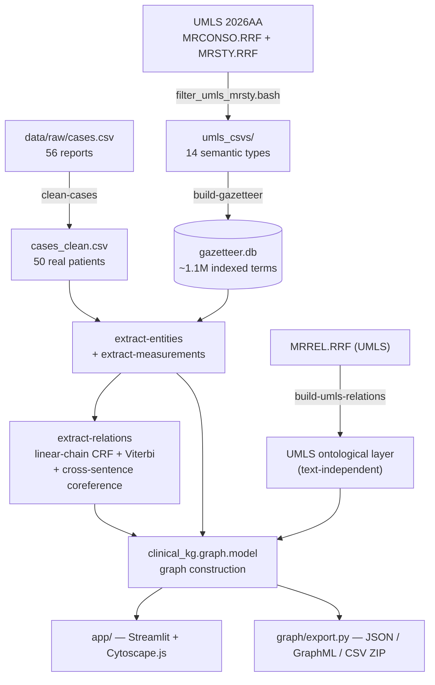
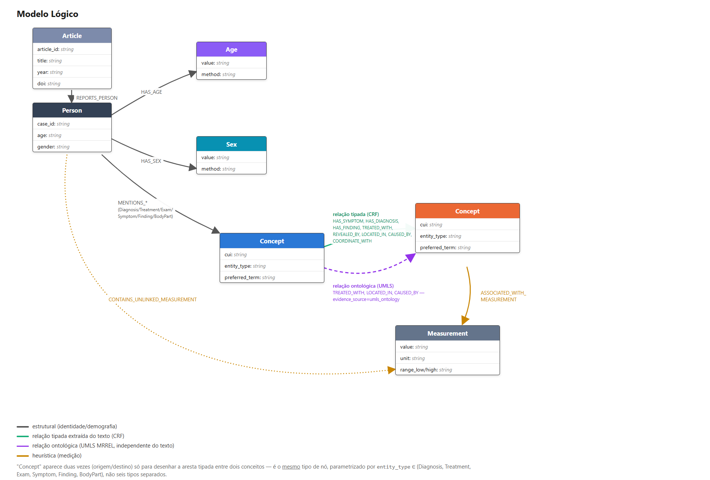

# Extração de Entidades Clínicas e Construção de um Grafo de Conhecimento a partir de Relatos de Caso
# Clinical Entity Extraction and Knowledge Graph Construction from Case Reports

## Slides

https://canva.link/6aev1x8heygc4ez 

## Project Structure

```
.
├── README.md                <- Project documentation (this file)
│
├── data
│   ├── external                <- Third-party data in input format for transformation
│   ├── interim                  <- Intermediate data, e.g., transformation results
│   ├── processed                <- Final data used for publication/analysis
│   └── raw                      <- Original data without modifications
│
├── pipelines
│   └── notebooks                <- Jupyter notebooks
│
├── pyproject.toml            <- Packaging, dependencies and the clinical-kg command
├── Makefile                   <- Zero-install entry points (make test / all / app)
│
├── src                         <- Source code (src-layout: one installable package)
│   └── clinical_kg
│       ├── README.md              <- Architecture, layering and data flow
│       ├── paths.py                <- Single source of truth for project paths
│       ├── cli.py                   <- One dispatcher over every pipeline stage
│       ├── corpus/                  <- Case cleaning and patient records
│       ├── gazetteer/               <- UMLS term dictionary (SQLite)
│       ├── extraction/              <- Entities and measurements
│       ├── relations/               <- Typed clinical relations (CRF)
│       ├── graph/                    <- Graph model, export and viewer
│       └── app/                       <- Streamlit front end
│
├── tests                        <- Test suite (python3 -m unittest discover -s tests)
│
└── assets                       <- Media used in the project
    ├── images                      <- Images used in README.md
    └── slides                       <- Presentation slides
```


## Methodology

The pipeline starts from two independent inputs — the case-report corpus (MultiCaRe/PMC) and the
UMLS controlled vocabulary — which converge at entity extraction and, from there, feed relation
extraction:



**Stage 1 — Corpus cleaning (`clinical-kg clean-cases`).** The source dataset has 56 rows, but not
every row is a patient: 2 articles have a single patient's report fragmented across several rows
(`PMC6083636` in 3 parts, `PMC11259348` in 2), and 3 rows are not single-patient cases at all (a
retrospective-cohort summary with 115 patients, a dental-teaching-methodology article, and a
sociology article about Theranos — all incorrectly marked `case_amount=1` in the source). After
merging and dropping these, **50 real patients** remain. The original `age`/`gender` columns also
have confirmed errors (a newborn at 39 weeks of gestation was recorded as `age=39`), so both fields
are re-extracted from the text itself:

~~~python
# "newborn"/"neonate" is definitional: age 0, full stop -- overrides
# any week/day figure in the same clause, which describes gestational
# age or birth weight, not time since birth.
if NEWBORN_RE.search(opening):
    return "0", "newborn-keyword"
~~~

The original values are preserved in `age_upstream`/`gender_upstream` for auditing.

**Stage 2 — Controlled vocabulary (`filter_umls_mrsty.bash` + `build-gazetteer`).** UMLS 2026AA is
filtered to English, non-suppressed terms from 6 source vocabularies (`SNOMEDCT_US`, `MSH`, `LNC`,
`RXNORM`, `ICD10CM`, `MTH`) restricted to 14 semantic types (TUI). The result is indexed in SQLite
as a gazetteer of ~1.1 million terms, with an efficient longest-match lookup that never loads the
whole thing into memory.

**Stage 3 — Entity extraction (`clinical-kg extract-entities`).** At every position in the text, the
extractor tries a 6-token window down to 1, skipping ahead past whatever matched:

~~~python
found, i = [], 0
while i < len(toks):
    hit = None
    for n in range(min(max_n, len(toks) - i), 0, -1):
        window = toks[i:i + n]
        norm = normalize(" ".join(t[0] for t in window))
        row = con.execute(LOOKUP, (norm,)).fetchone()
~~~

Each semantic type (TUI) maps to one of the project's 6 categories: **Diagnosis, Treatment, Exam,
Symptom, Finding, BodyPart**. While auditing the results we noticed ~175 occurrences were generic
words or consent-form boilerplate that happened to match a real UMLS concept (e.g., the bare word
"treatment", "diagnosis" or "emergency", which is literally an MSH concept) — these were excluded
by CUI/term (`EXCLUDED_CUIS`/`EXCLUDED_TERMS`), leaving **2,957 entities** (down from a raw
extraction of 3,134).

**Stage 4 — Measurements and linking (`clinical-kg extract-measurements`).** Value+unit patterns
(`4 cm`, `10-140 U/L`, `40 mg`, `day 8`) are linked to the nearest entity that precedes them in the
same sentence — also checking right after, for adjective phrases ("8 cm spleen") — with a
character window as a last resort:

~~~python
def best_backward(candidates):
    chosen = None
    for ent in candidates:
        if ent["end"] > meas["start"]:
            continue
        if chosen is None or ent["end"] > chosen["end"]:
            chosen = ent
    return chosen
~~~

**Stage 5 — Relation extraction (`clinical-kg extract-relations`, `clinical_kg/relations/`
module).** Up to this point the graph could only say *"this case mentions `chest pain` and
`hypertension`"* — never that one was revealed by an exam or treated with a drug. This stage fixes
that with a **linear-chain CRF** that BIO-tags relation triggers over each sentence and decodes with
**Viterbi**:

~~~python
"trans.B_I":               1.5,   # keep multi-token triggers ("was treated with")
"trans.B_B":              -3.0,   # no two adjacent independent triggers
"trans.max_trigger_len":   3,     # hard cap; I->I beyond this is -inf
~~~

There is no labeled data for this corpus, so the CRF weights are **hand-set** (a single, auditable
`WEIGHTS` dictionary), but the **decision threshold** (`decide.threshold`) is no longer guessed: it
was measured against the gold set (see Results) and moved from 1.5 to **1.0**, the point that
improves recall without giving up meaningful precision. Every edge records exactly which weights
fired, in the `rule_path` column.

Two pieces were added after the first version of the CRF:

- **Cross-sentence coreference** (`relations/core/coreference.py`): a trigger with no entity to its
  left ("Diagnosed with pneumonia. Subsequently treated with ceftriaxone.") now still anchors to
  the patient, inheriting context from the previous sentence — without this, that relation was
  simply unreachable.
- **UMLS ontological layer** (`relations/ontology.py`, `clinical-kg build-umls-relations`): beyond
  the text, if two concepts appearing in the same patient already have a documented relation in
  UMLS (`MRREL.RRF` — `may_treat`/`may_be_treated_by` → `TREATED_WITH`,
  `has_finding_site`/`finding_site_of` → `LOCATED_IN`, `has_causative_agent`/`causative_agent_of`
  → `CAUSED_BY`), that relation is added as **independent evidence**, tagged
  `evidence_source=umls_ontology` and never conflated with the text-extracted relation. The
  direction of each `RELA` was **verified empirically** against the real `MRREL.RRF`, not assumed
  from the name's grammar — `may_treat`/`may_be_treated_by` are not mirror images of each other.

The decoded trigger attaches to the **nearest entity on each side within the same clause**.
Comma-separated lists become `COORDINATE_WITH` edges that inherit the relation of the list's first
item, provided they share the same `entity_type` (or a compatible group — `Symptom`/`Finding`/
`Diagnosis` — since the gazetteer often types one item inconsistently in an otherwise clean symptom
list). Finally, a NegEx/ConText-style negation scope labels every edge as `affirmed`, `negated`,
`hedged`, `historical` or `family`.

**Full documentation of each stage** is in
[`src/clinical_kg/relations/README.md`](src/clinical_kg/relations/README.md).

## Related Work

The project adopts a **deterministic lexical NER** approach (gazetteer + longest match) instead of
a statistical or transformer-based extractor. In the clinical NLP literature, this choice compares
to two well-established tool families built on the same UMLS:

- **MetaMap** (Aronson, 2001) — NLM's reference tool for mapping biomedical text to the UMLS
  Metathesaurus; it uses linguistic analysis and variant generation to find concepts, with broader
  coverage but less predictability than a closed gazetteer.
- **cTAKES** (Savova et al., 2010) — the Mayo Clinic's clinical NLP pipeline built on Apache UIMA,
  with negation, section and assertion-status modules; the typed-relation layer (Stage 5) covers
  part of that scope with its own CRF instead of UIMA.
- **scispaCy** (Neumann et al., 2019) — statistical (spaCy) models trained for biomedical NER, with
  UMLS linking via character-level approximation.

Choosing a longest-match gazetteer prioritizes **determinism and auditability**: every extracted
entity is traceable to a rule and an exact gazetteer term, with no dependency on a model, GPU or
training data.

For relation extraction (Stage 5), with no labeled data for this corpus, the team chose a
**classic linear-chain CRF** (Lafferty et al., 2001) instead of a neural relation extractor.
Negation/assertion modeling follows the **NegEx** line (Chapman et al., 2001) and its extension
**ConText** (Harkema et al., 2009). The additional ontological layer (Stage 5) follows the
**distant supervision**/external-knowledge tradition in relation extraction (Mintz et al., 2009),
using UMLS's own relation network as a second, text-independent evidence source.

## Logical Model

The team's property-graph model: each box is a **node type** with its properties, and each arrow
is an **edge type** between node types. `Concept` appears twice (source/target) only to draw the
typed edge between two concepts — it is the same node type, parameterized by `entity_type` ∈
{Diagnosis, Treatment, Exam, Symptom, Finding, BodyPart}, not six separate types. The three
clinical relation layers (structural, text-extracted via CRF, and UMLS-ontological) appear side by
side, each with its own edge color/style:



- **Structural nodes:** `Article`, `Person`, `Age`, `Sex`.
- **Clinical concept nodes:** one per aggregated CUI (`Concept`), typed by property
  (`entity_type` ∈ {Diagnosis, Treatment, Exam, Symptom, Finding, BodyPart}) instead of one node
  label per category.
- **Measurement node:** `Measurement` (value, unit, range).
- **Identity:** `person:{case_id}` · `concept:{cui}` · `measurement:{case_id}:{start}:{end}` ·
  `age:{case_id}` / `sex:{case_id}`.
- **Three clinical relation layers** coexist in the same graph and must not be confused:

| Source | Relation | Target | Layer |
|---|---|---|---|
| Article | `REPORTS_PERSON` | Person | structural |
| Person | `HAS_AGE` / `HAS_SEX` | Age / Sex | structural |
| Person | `MENTIONS_DIAGNOSIS` \| `_TREATMENT` \| `_EXAM` \| `_SYMPTOM` \| `_FINDING` \| `_BODY_PART` | Concept | mention (no semantic typing) |
| Concept | `ASSOCIATED_WITH_MEASUREMENT` | Measurement | heuristic |
| Person | `CONTAINS_UNLINKED_MEASUREMENT` | Measurement | heuristic |
| Concept | `HAS_SYMPTOM` \| `HAS_DIAGNOSIS` \| `HAS_FINDING` \| `TREATED_WITH` \| `REVEALED_BY` \| `LOCATED_IN` \| `CAUSED_BY` \| `COORDINATE_WITH` | Concept | **typed relation extracted from text (CRF)** |
| Concept | `TREATED_WITH` \| `LOCATED_IN` \| `CAUSED_BY` (`evidence_source=umls_ontology`) | Concept | **ontological relation (UMLS, text-independent)** |

The original `MENTIONS_*` only asserts that a term appears in the text
(`assertion_status=not_assessed`). The **CRF typed-relation** layer is what distinguishes
*"treated with"* from *"revealed by"* from *"located in"*, each with its own `assertion_status`.
The **UMLS ontological** layer is general medical knowledge, not a claim about that specific
patient's text — so it carries its own provenance tag and never shares an edge id with a
text-extracted relation.

## Analyses That Can Be Performed

- **Diagnosis–treatment co-occurrence**: which treatments are mentioned alongside which diagnoses,
  aggregated by CUI rather than by text occurrence.
- **Vocabulary concentration**: which CUIs/terms concentrate the most mentions in the corpus, by
  category.
- **Demographic cross-tabulation**: distribution of clinical categories by re-extracted age range
  and sex.
- **Measurement distribution per linked entity**: ranges of lab values associated with a given Exam
  or Diagnosis across patients.
- **Patients with shared findings**: two-hop Person→Concept←Person paths to find patients who share
  an uncommon diagnosis or finding.
- **Filtering by link confidence**: repeat any analysis using only `same_sentence` edges (high
  confidence), discarding `window_fallback`.
- **Typed-relation–driven queries**: "which findings were `REVEALED_BY` which exam", "which
  `TREATED_WITH` is associated with which `HAS_DIAGNOSIS`".
- **Filtering by assertion status**: repeat any query using only `affirmed` relations, excluding
  `negated`/`hedged`/`historical`/`family`.
- **Text vs. general-knowledge comparison**: for the types covered by both layers
  (`TREATED_WITH`, `LOCATED_IN`, `CAUSED_BY`), compare what the text asserts about a specific
  patient with what UMLS documents as a general relation between the same concepts.

## Tools

- **Python 3.11, stdlib only in the pipeline** — the entire `clinical_kg` package runs with no
  third-party dependencies, a deliberate choice to keep extraction reproducible on any machine.
- **`pyproject.toml` + `Makefile`** — a single `clinical-kg <stage>` command; `make test` /
  `make all` / `make app` cover the full cycle.
- **Hand-written linear-chain CRF** (`relations/core/crf.py` + `features.py`) — emissions,
  transitions and Viterbi implemented directly, with no ML framework.
- **SQLite** as an indexed gazetteer — longest-match lookup over ~1.1M terms without loading them
  into memory.
- **UMLS Metathesaurus 2026AA** as the controlled vocabulary and, now, also as a **second relation
  source** (`MRREL.RRF`) — not redistributed due to its license; each user downloads and rebuilds
  it locally.
- **Streamlit + Cytoscape.js 3.33.1** (bundled locally, MIT) for the interactive viewer — the
  pipeline's only external dependency, along with pandas.
- **Playwright** for the browser smoke test.
- **Claude Code** as a development assistant (see the LLM section below).

## Results

| Metric | Value |
|---|---|
| Patients in the cleaned corpus | 50 (from 56 original rows) |
| Entities extracted | **2,957** (from a raw extraction of 3,134 — ~175 generic false positives removed) |
| Measurements extracted | 535 |
| Measurements linked to an entity | 507 (95%) — 368 `same_sentence`, 54 `same_sentence_forward`, 85 `window_fallback` |
| Terms in the UMLS gazetteer | ~1.1 million, covering ~644 thousand CUIs |
| **Typed relations extracted (CRF)** | **1,356** across 50 patients, in 8 types |
| **Ontological relations (UMLS, independent layer)** | 213, in 3 types (`TREATED_WITH`/`LOCATED_IN`/`CAUSED_BY`) |

Distribution of text-extracted relations:

| Relation | N | | Assertion status | N |
|---|---|---|---|---|
| `TREATED_WITH` | 269 | | `affirmed` | 1,170 |
| `LOCATED_IN` | 239 | | `negated` | 95 |
| `REVEALED_BY` | 200 | | `hedged` | 48 |
| `HAS_DIAGNOSIS` | 189 | | `historical` | 32 |
| `COORDINATE_WITH` | 185 | | `family` | 11 |
| `HAS_FINDING` | 184 | | | |
| `HAS_SYMPTOM` | 55 | | | |
| `CAUSED_BY` | 35 | | | |

### Evaluation against the gold set

The team manually annotated **424 candidates** (10 cases, two annotators — 9/10 agreement on the
overlap) using `clinical-kg annotate-relations`. Against this gold set, at the measured decision
threshold (`decide.threshold=1.0`):

**P=0.602 · R=0.653 · F1=0.626** (0.772 relation-type accuracy, 0.917 assertion accuracy)

| Relation | F1 |
|---|---|
| `HAS_SYMPTOM` | 0.818 |
| `REVEALED_BY` | 0.744 |
| `LOCATED_IN` | 0.702 |
| `HAS_DIAGNOSIS` | 0.667 |
| `TREATED_WITH` | 0.632 |
| `COORDINATE_WITH` | 0.540 |
| `HAS_FINDING` | 0.462 |
| `CAUSED_BY` | 0.444 |

The ablation table shows that **list coordination** is by far the largest contributor (removing it
drops F1 from 0.626 to 0.477, -0.150) — consistent with the finding that 34% of adjacent entity
pairs have a comma between them. `HAS_FINDING` is the weakest point for a known reason: it is the
fallback category when no more specific one fits, which produces systematic false positives;
`CAUSED_BY` has only 4 examples in the gold set — too few to trust the number in either direction.
The decision threshold itself was chosen by measurement, not assumption: at the previous threshold
(1.5), F1 was 0.501 (R=0.428); at 1.0, it rises to 0.626 (R=0.653) with no meaningful loss of
precision.

All 71 automated tests in the project pass on this same checkout.

## How Language Models Were Used

**They were not used in extraction itself.** NER, measurement linking and relation extraction are
all deterministic (gazetteer + rules + a hand-weighted CRF, calibrated by measurement against real
data — not a language model or a trained neural network), a deliberate choice to keep every entity
and every relation traceable to an auditable rule, with no risk of hallucination over clinical
text — see "Related Work" above for a comparison with approaches that use statistical or neural
NLP.

Language models (Claude Code, Codex) were used as **development assistants** throughout the
project: implementing and refactoring code (including cross-sentence coreference and the UMLS
ontological layer), debugging real data bugs (a `\r\n`/`\n` line-ending issue across machines that
invalidated annotation offsets, and several false entities generated by generic gazetteer words),
reorganizing the source code, and generating this document and the logical model diagram. Every
code suggestion was reviewed and validated against the automated test suite (71 tests) and against
the manually annotated gold set before being incorporated.

## Project Structure

```
.
├── README.md                <- Project documentation (this file)
│
├── data
│   ├── external                <- Third-party data in input format for transformation
│   ├── interim                  <- Intermediate data, e.g., transformation results
│   ├── processed                <- Final data used for publication/analysis
│   └── raw                      <- Original data without modifications
│
├── pipelines
│   └── notebooks                <- Jupyter notebooks
│
├── pyproject.toml            <- Packaging, dependencies and the clinical-kg command
├── Makefile                   <- Zero-install entry points (make test / all / app)
│
├── src                         <- Source code (src-layout: one installable package)
│   └── clinical_kg
│       ├── README.md              <- Architecture, layering and data flow
│       ├── paths.py                <- Single source of truth for project paths
│       ├── cli.py                   <- One dispatcher over every pipeline stage
│       ├── corpus/                  <- Case cleaning and patient records
│       ├── gazetteer/               <- UMLS term dictionary (SQLite)
│       ├── extraction/              <- Entities and measurements
│       ├── relations/               <- Typed clinical relations (CRF)
│       ├── graph/                    <- Graph model, export and viewer
│       └── app/                       <- Streamlit front end
│
├── tests                        <- Test suite (python3 -m unittest discover -s tests)
│
└── assets                       <- Media used in the project
    ├── images                      <- Images used in README.md
    └── slides                       <- Presentation slides
```

`pipelines/workflows` is intentionally absent: the assignment allows "Orange or an equivalent
visual workflow tool", and this project does not use one — an empty, unused folder would be exactly
the kind of clutter this project avoids.

## References

- Aronson AR. Effective mapping of biomedical text to the UMLS Metathesaurus: the MetaMap program.
  *Proc AMIA Symp.* 2001:17-21. Link: https://pubmed.ncbi.nlm.nih.gov/11825149/ 
- Bodenreider O. The Unified Medical Language System (UMLS): integrating biomedical terminology.
  *Nucleic Acids Research.* 2004;32(Suppl 1):D267-D270. Link: https://doi.org/10.1093/nar/gkh061
- Savova GK, Masanz JJ, Ogren PV, Zheng J, Sohn S, Kipper-Schuler KC, Chute CG. Mayo clinical Text
  Analysis and Knowledge Extraction System (cTAKES): architecture, component evaluation and
  applications. *J Am Med Inform Assoc.* 2010;17(5):507-513. Link: https://doi.org/10.1136/jamia.2009.001560
- Neumann M, King D, Beltagy I, Ammar W. ScispaCy: Fast and Robust Models for Biomedical Natural
  Language Processing. *Proceedings of the 18th BioNLP Workshop and Shared Task.* 2019.
  https://arxiv.org/abs/1902.07669 
- Lafferty J, McCallum A, Pereira FCN. Conditional Random Fields: Probabilistic Models for
  Segmenting and Labeling Sequence Data. *Proceedings of the 18th International Conference on
  Machine Learning (ICML).* 2001:282-289. Link: https://www.cs.columbia.edu/~jebara/6772/papers/crf.pdf
- Chapman WW, Bridewell W, Hanbury P, Cooper GF, Buchanan BG. A Simple Algorithm for Identifying
    Negated Findings and Diseases in Discharge Summaries. *Journal of Biomedical Informatics.*
    2001;34(5):301-310. Link: https://pubmed.ncbi.nlm.nih.gov/12123149/
- Project documentation: [`src/README.md`](src/README.md) (installation/running),
  [`data/README.md`](data/README.md), [`src/clinical_kg/README.md`](src/clinical_kg/README.md),
  [`src/clinical_kg/relations/README.md`](src/clinical_kg/relations/README.md).
